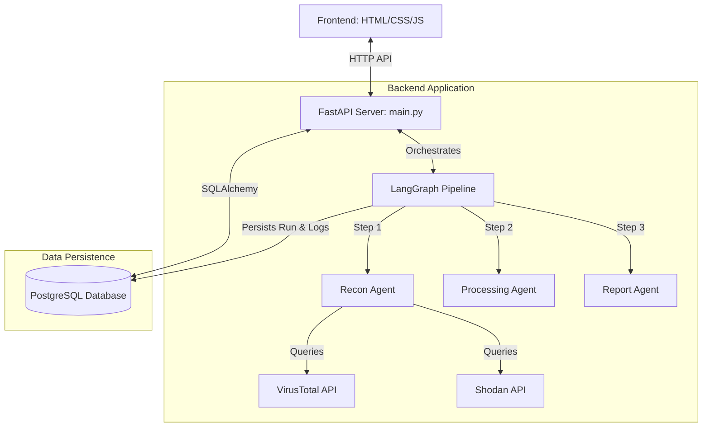

# Project Architecture & Logic Map

This document serves as a comprehensive reference guide for the **Agentic AI Recon Interface**. It maps out the code flow, data structures, backend pipelines, database integrations, and frontend aesthetics.

---

## 1. High-Level Architecture

The application is structured as a full-stack dashboard powered by a multi-agent orchestration pipeline.



---

## 2. Directory Structure & File Index

```
MyAgentProject/
├── docker-compose.yml       # Orchestrates the web server and PostgreSQL containers
├── Dockerfile               # Configures the Python/Uvicorn runtime environment
├── LICENSE                  # MIT License with attribution details
├── requirements.txt         # Project dependencies (FastAPI, LangGraph, SQLAlchemy, etc.)
├── README.md                # Getting started and setup guide
├── steps-to-understand.md   # Step-by-step summary of the pipeline
├── architecture-map.md      # [This File] Deep-dive code map
│
├── frontend/                # Static Web Application
│   ├── index.html           # Main dashboard markup (uses cache-busted stylesheet)
│   ├── styles.css           # Glassmorphic cyber design (collapsible subdomains, footer)
│   ├── app.js               # Frontend controller (fetches runs, handles copies, submits scans)
│   └── favicon.png          # App favicon branding
│
└── src/                     # Backend Python Application
    ├── main.py              # FastAPI server instance, CORS, static mounting, and router registration
    │
    ├── Core/                # Graph Orchestration
    │   ├── state.py         # Pydantic BaseModel AgentState (with dictionary compatibility)
    │   └── orchestrator.py  # LangGraph structure (Recon -> Processing -> Report)
    │
    ├── Agents/              # AI Agents
    │   └── agents.py        # recon_agent, processing_agent, and report_agent implementations
    │
    ├── Tools/               # Integrations & Crawling
    │   └── tools.py         # VirusTotal, Shodan, HTTP probing, and domain parsing helpers
    │
    └── Database/            # ORM Persistence
        ├── database.py      # PostgreSQL Connection pool & session builder
        └── models.py        # SQLAlchemy Schema definitions (ScanRun, ScanLog)
```

---

## 3. Database Schema

The system persists scan history and live terminal-like step logs to a PostgreSQL database.

### `scan_runs` Table
Stores the results of all completed and failed reconnaissance pipelines.
- `run_id` (UUID, Primary Key): Unique identifier for the scan.
- `input` (Text): The domain/URL target scanned.
- `status` (String): Status of the run (`running`, `completed`, `failed`).
- `output` (JSONB): The final structured report containing summary, risk level, subdomains, endpoints, technologies, insights, and citations.
- `metrics` (JSONB): Validation metrics (e.g. evaluation score out of 100, tool errors).
- `errors` (Integer): Count of exceptions hit during execution.
- `timestamp` (DateTime): Record creation time.

### `scan_logs` Table
Stores granular log events emitted by agents in real-time.
- `id` (Integer, Primary Key)
- `run_id` (UUID, Foreign Key → `scan_runs.run_id`)
- `agent` (String): Emitting agent name (e.g. `recon`, `processing`, `report`).
- `event` (String): Phase description (e.g. `start`, `complete`, `failed`).
- `status` (String): Outcome (`success`, `error`).
- `message` (Text): Details or stack trace message.
- `timestamp` (DateTime)

---

## 4. Code & Logic Walkthrough

### State Management (`src/Core/state.py`)
To avoid breaking legacy dict-like syntax (`state["key"]`) while adopting `pydantic.BaseModel` type safety, the `AgentState` overrides container methods:
```python
class AgentState(BaseModel):
    input: str
    data: Dict[str, Any] = Field(default_factory=dict)
    output: Dict[str, Any] = Field(default_factory=dict)
    steps: List[str] = Field(default_factory=list)
    errors: int = 0
    metrics: Dict[str, Any] = Field(default_factory=dict)

    # Dictionary compatibility overrides:
    def __getitem__(self, item):
        return getattr(self, item)

    def __setitem__(self, key, value):
        setattr(self, key, value)

    def __contains__(self, item):
        return hasattr(self, item)

    def get(self, key, default=None):
        return getattr(self, key, default)
```

### Orchestration Graph (`src/Core/orchestrator.py`)
Sets up a `StateGraph` linking:
1. `recon_node` $\rightarrow$ calls `recon_agent`
2. `processing_node` $\rightarrow$ calls `processing_agent`
3. `report_node` $\rightarrow$ calls `report_agent`

On finish, it runs the `evaluate` function:
- Calculates an evaluation score.
- Saves the final run and state to the PostgreSQL database.

---

### Agent Workflows (`src/Agents/agents.py` & `src/Tools/tools.py`)

#### 1. Recon Agent
Calls `analyze_domain(domain)` which coordinates threat intel APIs:
- **VirusTotal API** (`virustotal_scan`): Gets domain registrar metadata, categorization, and engine votes.
- **Shodan API** (`shodan_scan`): Resolves the host IP and pulls active ports and known vulnerabilities (CVEs).
- **Subdomain Finder** (`find_subdomains`): Looks up subdomains using VirusTotal's `/domains/{domain}/subdomains` endpoint.
- **Endpoint Scanner** (`scan_endpoints`): Scans the homepage and maps active endpoints.

#### 2. Processing Agent
Deduplicates all subdomains and endpoints. Categorizes endpoints into `open` and `forbidden`, filtering out notable security-sensitive paths like `/admin`, `/auth`, `/api`, and `.env`.

#### 3. Report Agent
Formats a comprehensive prompt, calls the LLM, and parses the structured response.
> **Critical Logic**: The report agent copies the complete original subdomain list (`data["subdomains"]`) and endpoint list (`data["endpoints"]`) directly onto the parsed output dictionary. This prevents the LLM from truncating or leaving out subdomains when returning long lists.

### Historical Diffing Engine (`src/Core/diffing.py`)
Provides dynamic analysis of changes since the target's most recent previous scan:
- **Prior Scan Match**: Queries the PostgreSQL database (`get_last_scan_for_domain`) for case-insensitive exact match of domain input.
- **Diff Analysis**: Computes subdomain and endpoint additions/removals, flags changes in risk levels, and calculates deltas for malicious voting indicators.
- **Graceful Null State**: Returns `null` on first scan, and safely returns `{}` on malformed data or exceptions.

---

## 5. Frontend UI Engine (`frontend/app.js` & `styles.css`)

### Collapsible Subdomains
To avoid rendering thousands of lines and cluttering the cyber dashboard, the subdomains layout slices the array:
- The first **7 subdomains** are rendered as normal inline grid blocks.
- Any remaining subdomains are placed in a `<details class="subdomains-dropdown">` container.
- When clicked, a CSS rule rotates the arrow marker:
  ```css
  .subdomains-dropdown summary::after {
      content: " ▾";
      display: inline-block;
      transition: transform 0.2s ease;
  }
  .subdomains-dropdown[open] summary::after {
      transform: rotate(180deg);
  }
  ```

### License Footer
Positioned at the bottom of the left-hand sidebar inside `.sidebar-footer`, presenting the license and copyright holder in a compact, semi-transparent font.
